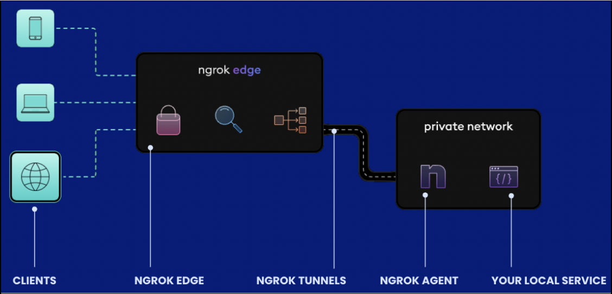

= Laboratorio de construcción de software/Proyecto Profesional 1: Trabajo Practico Inicial

:title-page:
:numbered:
:source-highlighter: coderay
:tabsize: 4
Universidad Nacional de General Sarmiento

Docentes: Juan Carlos Monteros y Evelyn Aragon 

Alumnos: Gabriel Althaparro <gabriel.altha@gmail.com>; Federico Gonzalez <federico.l.g8195@gmail.com>; Esteban Ezequiel Lucero <este.lucero2212@gmail.com>; 

Comisión 1

Contenidos::
1. Introducción
2. Documento de Investigacion
3. Documentación Técnica y Funcional del Chatbot
4. Documentación del ChatBot como servicio

== Introducción
El presente trabajo tiene como objetivo presentar una propuesta para el desarrollo de una aplicación destinada a facilitar la reserva de canchas de fútbol, integrando un chatbot para la atención al cliente y un sistema de autenticación biométrica basado en huella dactilar para garantizar la seguridad y privacidad de los usuarios.

La creación de esta aplicación surge como respuesta a la necesidad de optimizar y agilizar el proceso de reserva de canchas deportivas, ofreciendo a los usuarios una experiencia intuitiva y segura. La combinación de un chatbot inteligente con la autenticación biométrica promete proporcionar una solución innovadora que mejore la accesibilidad y la protección de los datos personales de los usuarios.

== Documento de Investigacion

=== Aplicación De La Inteligencia Artificial

La IA hoy en día es una de las tecnologías más innovadoras y utilizadas tanto en sistemas de software como en diferentes aparatos tecnológicos como los drones, robots y vehículos autónomos. Tan es así que la aplicación de la IA se encuentra en los lugares más cotidianos de nuestra vida como puede ser las publicidades que se manifiestan en diferentes páginas web a partir de que estas mismas están personalizadas por el estudio de nuestros comportamientos, los asistentes digitales integrados en nuestros celulares para poder ofrecer ayuda y dar accesibilidad al usuario que los usa, las traducciones automáticas para diferentes textos y archivos.

Por otro lado, a nivel profesional la IA se puede utilizar para diferentes rubros tales como la medicina en donde esta ayuda realizar diagnósticos de los pacientes, predecir resultados de como el paciente va a reaccionar a diferentes medicamentos y ayudar a las personas con sus tratamientos medicinales a partir de diferentes métricas. También abarcan el rubro de la Ciberseguridad esto es para poder reconocer a partir de diferentes patrones si hay una amenaza de ciberataque o para proteger la integridad de los usuarios a partir de utilizar reconocimiento facial o dactilar en pos de evitar accesos indebidos. 

No obstante, la IA también ayudo a nivel empresarial, ya que hoy en día podemos observar que gran parte de las ayudas para los usuarios de diferentes servicios son atendidas primera por un asistente virtual, programados con IA y utilizando la tecnología de ChatBot, que para poder solucionar sus problemas y en caso de no ser atendida la urgencia esta se pone en manos del personal de la empresa. Esto ayuda a nivel empresarial, ya que reducen la cantidad de urgencias que debe atender el personal.

Estas revisiones de la aplicación de la IA nos llevaron a darnos cuenta de la importancia de la misma debido al alto grado de utilización que tiene tanto en nuestra vida cotidiana como en la profesional. Y gracias a esto poder tener una mejor decisión a la hora de tomar tecnologías para el objetivo de este trabajo practico.  

=== OnBording Digital

El OnBording digital refiere al proceso donde se va a iniciar una relación con el cliente de manera digital para que estas hagan uso del producto de software. Para poder realizar esta relación es necesario de poder validar la identidad del cliente de manera segura y simple para poder garantizar la autenticidad y seguridad de los usuarios a partir de diferentes pruebas.

Gracias a la IA el proceso de OnBording va a ser posible que estas pruebas se automaticen y se verifiquen, lo más rápido posible, a partir de que se realicen ciertos pasos en el procedimiento de inscripción. Cuyo primer paso es verificar el documento de identidad del cliente a partir de escanear el mismo en ambas caras a partir de utilizar tecnologías OCR junto con la IA y el Machine Learning. Luego de verificar el documento se sigue por examinar los datos biométricos del cliente partiendo en que el cliente se saque una foto de frente, en donde se muestre correctamente sus rasgos faciales, y escanee sus huellas dactilares para así comprobar si el documento de identidad, las bases de datos con información del individuo y su persona tienen correlación. Cabe recalcar que estos pasos tienen medidas de antifraude para que no se cometan errores en la examinación.

También para verificar la autenticidad del cliente lo que se realiza es una consulta a listas de Anti Money Laundering (AML) para rastrear que el cliente no esté incumbido en actividades fraudulentas como lo pueden ser fraude de identidad, lavado de activos, financiar organizaciones terroristas, poseer sanciones económicas.

=== Normativas

Al día de hoy en Argentina no hay leyes que incumban incluyan a las inteligencias artificiales, pero ante el crecimiento exponencial de estas tecnologías la ONU describió 6 puntos de recomendación que importan en términos éticos. Estos puntos son: 

* Proporcionalidad e inocuidad. En caso de que pueda producirse cualquier daño para los seres humanos, debe garantizarse la aplicación de procedimientos de evaluación de riesgos y la adopción de medidas para impedir que ese daño se produzca.

* Seguridad y protección. Los daños no deseados (riesgos de seguridad) y las vulnerabilidades a los ataques (riesgos de protección) deben ser evitados y deben tenerse en cuenta, prevenirse y eliminarse durante el ciclo de vida de los sistemas de IA para garantizar la seguridad y la protección de los seres humanos, del medio ambiente y de los ecosistemas.

* Equidad y no discriminación. Los actores de la Inteligencia artificial deben promover la diversidad y la inclusión, garantizar la justicia social, proteger la equidad y luchar contra todo tipo de discriminación, de conformidad con el derecho internacional. Los actores de la IA deberían hacer todo lo razonablemente posible por reducir al mínimo y evitar reforzar o perpetuar aplicaciones y resultados discriminatorios o sesgados a lo largo del ciclo de vida de los sistemas de IA, a fin de garantizar la equidad de dichos sistemas.

* Supervisión y decisión humanas. La decisión de ceder el control a los sistemas de IA en contextos limitados sigue siendo de los seres humanos, porque un sistema de IA no puede reemplazar la responsabilidad final de los seres humanos y su obligación de rendir cuentas.

* Transparencia y explicabilidad. La transparencia y la explicabilidad de los sistemas de IA son condiciones previas fundamentales para garantizar el respeto, la protección y la promoción de los derechos humanos, las libertades fundamentales y los principios éticos. Las personas deben tener la oportunidad de pedir explicaciones e información al responsable de la IA o a las instituciones del sector público correspondientes.

* Sensibilización y educación. La sensibilización y la comprensión del público sobre las tecnologías de IA y el valor de los datos deben promoverse mediante una educación abierta y accesible, la participación cívica, las competencias digitales y la capacitación en materia de ética del uso de la IA. También debe realizarse la alfabetización mediática e informacional y la capacitación dirigida conjuntamente por los gobiernos, las organizaciones intergubernamentales, la sociedad civil, las universidades, los medios de comunicación, los dirigentes comunitarios y el sector privado, para garantizar una participación pública efectiva.

Por otro lado, la Unión Europea (UE) sí consta de regulaciones hacia la inteligencia artificial en donde garantiza que los sistemas con IA sean seguros, transparentes, trazables, no discriminatorios, respetuosos con el medio ambiente y que se regulen de manera manual por personas. Igualmente, la UE presenta dos tipos de riesgos en la IA y depende de este se determina cómo se actúa sobre la misma. El primero de ellos es el riesgo inaceptable que abarcan los sistemas que son una amenaza para la humanidad y serán prohibidos e incluyen:

* Manipulación cognitiva del comportamiento de personas o grupos vulnerables. 

* Específicos puntuación social: clasificación de personas en función de su comportamiento, estatus socioeconómico o características personales.

* Sistemas de identificación biométrica en tiempo real y a distancia, como el reconocimiento facial.

Este último se puede utilizar, pero en casos de perseguir delitos o si se tiene una aprobación judicial para el uso.
Para seguir tenemos los de alto riesgos que incluyen sistemas que afecten de manera negativa a la seguridad o a los derechos humanos y que serán evaluadas antes de su lanzamiento y a lo largo de su ciclo de vida, al igual que tendrán que atender reclamos de la ciudadanía.
Los sistemas con IA de alto riesgo se dividen en dos los cuales son:

1. Los sistemas de IA que se utilicen en productos sujetos a la legislación de la UE sobre seguridad de los productos. Esto incluye juguetes, aviación, automóviles, dispositivos médicos y ascensores.

2. Los sistemas de IA pertenecientes a ocho ámbitos específicos que deberán registrarse en una base de datos de la UE:

•	Identificación biométrica y categorización de personas físicas
•	Gestión y explotación de infraestructuras críticas
•	Educación y formación profesional
•	Empleo, gestión de trabajadores y acceso al autoempleo
•	Acceso y disfrute de servicios privados esenciales y servicios y prestaciones públicas
•	Aplicación de la ley
•	Gestión de la migración, el asilo y el control de fronteras
•	Asistencia en la interpretación jurídica y aplicación de la ley.

También los sistemas con IA tendrán que presentar transparencia y cumplir con la legislación de la UE en materia de derechos de autor.

=== Objetivos del ChatBot

El objetivo del proyecto es desarrollar un ChatBot avanzado para un complejo deportivo especializado en fútbol. Este asistente virtual estará diseñado para gestionar eficientemente las consultas de los usuarios, proporcionando información precisa sobre la ubicación del complejo, sus horarios de apertura y cierre, así como el nombre del mismo. Además, el ChatBot facilitará la verificación de disponibilidad de las canchas en fechas específicas, permitiendo a los usuarios realizar reservas, especificando la fecha, hora específica, cancha seleccionada y la duración del alquiler deseado, y se le retornará al usuario un número de reserva. Asimismo, el usuario podrá cancelarlas con el número de reserva.

=== Herramientas
Tras una exhaustiva investigación, exploramos diversas opciones para desarrollar una aplicación móvil utilizando Python. Entre las tres principales alternativas identificadas se encontraban:

* Utilizar la biblioteca Kivy.
* Flutter: para adaptar la aplicación de escritorio a móvil.
* Emplear Kotlin.

Inicialmente, nos inclinamos por Kivy, con el objetivo de crear la aplicación móvil utilizando un único lenguaje de programación. Sin embargo, conforme avanzaba el desarrollo, nos dimos cuenta de que Kivy no era la opción más adecuada para implementar el login con huella dactilar. Por ende, optamos por desarrollar la aplicación utilizando Kotlin.

En cuanto al desarrollo del ChatBot, decidimos utilizar Python junto con la biblioteca NLTK para tokenización y lematización. Para construir nuestro modelo neuronal, evaluamos tres opciones principales:

* Keras
* Scikit-learn
* PyTorch

Después de un análisis detallado, elegimos Keras debido a la abundancia de información disponible en internet y los pasos que propuso, los cuales consideramos razonables y comprensibles para nuestro equipo.

== Documentación Técnica y Funcional del Chatbot

=== Descripción General
En esta entrega presentaremos el ChatBot en una aplicación para reservas de cancha que utilizará inteligencia artificial (IA) para interactuar con usuarios mediante un chat de texto que resolverá las dudas del mismo. Esta IA utiliza una red neuronal artificial para comprender y responder a las consultas de los usuarios de manera automatizada y con un entrenamiento supervisado para su mejor funcionamiento.

=== Funcionalidad
En este apartado definiremos las principales funcionalidades que debe presentar la aplicación siendo la misma la primera entrega y dando mayor profundidad a lo que debe realizar el ChatBot lo cual es:
- Como usuario debemos poder preguntar la hora de apertura y cierre de las canchas de diferentes maneras al ChatBot para que nos dé la respuesta adecuada.
- Como usuario debemos poder preguntar el precio de la cancha de diferentes maneras al ChatBot para que nos dé la respuesta adecuada.
- Como usuario debemos poder preguntar los horarios de las canchas disponibles de diferentes maneras al ChatBot para que nos dé la respuesta adecuada.
- Como usuario debemos poder preguntar la ubicación del centro deportivo de diferentes maneras al ChatBot para que nos dé la respuesta adecuada.
- Como usuario debemos podremos tener una charla fluida con el ChatBot.
- Como usuario debemos poder preguntar otras formas de comunicación de diferentes maneras al ChatBot para que les dé el número de atención al cliente.
- Como usuario debemos poder reservar o cancelar alguna cancha de diferentes maneras al ChatBot para que les dé el número de atención al cliente.
Las Funcionalidades básicas de este ChatBot cubren las necesidades del usuario para que pueda tener información básica del centro de canchas de manera rápida y sencilla sin tener que esperar a la respuesta del personal.

=== Arquitectura
El ChatBot se basa en una arquitectura en donde el cliente a través de la interfaz de usuario enviará mensajes y el ChatBot responderá a partir de su entrenamiento, con un banco de datos propio, cuál es la mejor respuesta. La arquitectura incluye los siguientes componentes principales:
* Interfaz de Usuario: Interfaz a través de la cual los usuarios envían mensajes al chatbot.
* Procesamiento de Texto: Preprocesamiento de texto para convertir los mensajes de los usuarios en datos que la red neuronal pueda procesar.
* Red Neuronal: Modelo de red neuronal artificial que clasifica los mensajes de los usuarios en categorías y genera respuestas adecuadas.
* Integración con Datos: Integración con archivos de datos que contienen patrones de mensajes y respuestas asociadas para entrenar el modelo de red neuronal.

=== Tecnologías Utilizadas
El ChatBot está desarrollado utilizando las siguientes tecnologías principales:
* Python: Lenguaje de programación utilizado para escribir el código del ChatBot.
* Keras: Biblioteca de aprendizaje profundo utilizada para construir y entrenar el modelo de red neuronal.
* NLTK (Natural Language Toolkit): Biblioteca de procesamiento de lenguaje natural utilizada para tokenizar y lematizar palabras en los mensajes de los usuarios.
* JSON: Formato utilizado para almacenar los datos de entrenamiento del chatbot.
* Terminal: en esta entrega esta va a ser nuestra interfaz de usuario por el cual se va a poder interactuar con el ChatBot.

=== ¿Qué es NLTK, Tokenizar y Lematizar?
NLTK es una librería de Python que se utiliza para el procesamiento de lenguaje natural y que nos brinda herramientas para tokenizar y lematizar palabras que nos sirven como datos de entrenamiento para la red neuronal que va a utilizar el ChatBot. Ya visto lo que es NLTK nos consta de ver el significado de tokenizar que refiere a la acción de separar una frase en unidades más pequeñas tales pueden ser palabras, sub palabras o caracteres para poder hacer un correcto análisis léxico. Por último, después de tokenizar tendremos que lematizar que refiere al proceso lingüístico y de procesamiento de lenguaje natural que consiste en reducir las palabras a su forma base o raíz como puede ser el infinitivo de un verbo, el singular de un sustantivo y el singular masculino para los adjetivos.

=== Entrenamiento del Modelo
El modelo de red neuronal del ChatBot se entrena utilizando un conjunto de datos que contiene patrones de mensajes de usuarios y las respuestas asociadas. El proceso de entrenamiento implica los siguientes pasos:
* Tokenización y lematización de palabras en los mensajes de los usuarios.
* Generación de una representación de bolsa de palabras para cada mensaje.
* Entrenamiento de la red neuronal utilizando un modelo secuencial y un optimizador descenso de gradiente estocástico (SGD).
* Guardado del modelo entrenado para su posterior uso en la generación de respuestas.

=== Implementación
El ChatBot se implementa como una aplicación de consola en Python. La implementación incluye los siguientes archivos principales:
* train_chatbot.py: Script utilizado para entrenar el modelo de red neuronal utilizando los datos de entrenamiento. En donde las primeras líneas de código se utiliza la librería NLTK para poder procesar los datos y así poder generar un modelo de IA que esté bien entrenada.
* chatbot.py: Script principal que contiene la lógica del ChatBot, incluyendo la clasificación de mensajes de usuarios y la generación de respuestas.
* intents.json: Archivo JSON que contiene los patrones de mensajes y respuestas asociadas utilizadas para entrenar el modelo.

== Documentación del Login

=== Arrepentimiento de la librería de Kivy y nuevas soluciones

Durante el desarrollo de este proyecto, nuestra principal consideración fue la selección de una biblioteca para el frontend. Optamos por Kivy debido a su capacidad para desarrollar aplicaciones móviles directamente desde Python. Esta elección nos pareció especialmente útil, ya que nos permitía integrar nuestro modelo de ChatBot sin necesidad de recurrir a otros lenguajes de programación.

Inicialmente, contemplamos la posibilidad de implementar la autenticación mediante huella dactilar utilizando la librería "pyjnius", la cual permite a Python interactuar con clases nativas de Java o Android. Sin embargo, aunque esta opción era técnicamente factible, no resultaba práctica dadas las exigentes investigaciones que debíamos llevar a cabo como equipo para su implementación. Dado el tiempo limitado y la fecha de entrega prevista para el 1 de abril, decidimos explorar otras alternativas más viables.

Por consiguiente, optamos por desarrollar la aplicación utilizando Kotlin y aprovechar su integración con el ChatBot. Esta decisión nos permitió avanzar de manera más eficiente hacia nuestros objetivos, garantizando una entrega oportuna y satisfactoria.

=== Desarrollo de la GUI para el login

Una vez tomamos la decisión de desarrollar la aplicación en Kotlin, comenzamos a codificar la interfaz de usuario (GUI). Este proceso incluyó la creación del inicio de sesión, el cual se encuentra representado en el archivo "activity_main.xml" ubicado en la carpeta "res/layout". En este archivo, diseñamos un estilo personalizado para la pantalla inicial, donde el usuario se encuentra con una representación visual de una huella dactilar. Esta imagen funciona como un botón que permite al usuario acceder al ChatBot utilizando la huella dactilar registrada en su dispositivo.

=== Lógica del Login

Ya desarrollado la GUI para el acceso a la aplicación, vamos a explicar el funcionamiento del código para el inicio de sesión con la huella dactilar utilizada en el dispositivo móvil.
[source, Kotlin]
----
lateinit var binding: ActivityMainBinding
    lateinit var info: String

    private lateinit var executor: Executor
    private lateinit var biometricPrompt: BiometricPrompt
    private lateinit var promptInfo: BiometricPrompt.PromptInfo
----
El código comienza con la declaración de la variable "binding", que utiliza la clase "ActivityMainBinding" para facilitar la manipulación de las vistas definidas en "activity_main.xml". Posteriormente, se inicializa la variable "executor", empleando la clase "Executor", lo que permite la ejecución de actividades de manera asíncrona. Finalmente, se hace uso de la clase "BiometricPrompt" para implementar la validación biométrica y permitir el acceso a la aplicación.
[source, Kotlin]
----
override fun onCreate(savedInstanceState: Bundle?) {
        super.onCreate(savedInstanceState)
        binding = ActivityMainBinding.inflate(layoutInflater)
        setContentView(binding.root)

        // Verificar si el dispositivo admite la autenticación biométrica
        executor = ContextCompat.getMainExecutor(this)
        biometricPrompt = BiometricPrompt(this, executor,
            object : BiometricPrompt.AuthenticationCallback() {
                override fun onAuthenticationError(
                    errorCode: Int,
                    errString: CharSequence,
                ) {
                    super.onAuthenticationError(errorCode, errString)
                    Toast.makeText(applicationContext,
                        "Authentication error: $errString", Toast.LENGTH_SHORT)
                        .show()
                }

                override fun onAuthenticationSucceeded(
                    result: BiometricPrompt.AuthenticationResult,
                ) {
                    super.onAuthenticationSucceeded(result)
                    Toast.makeText(applicationContext,
                        "Authentication succeeded!", Toast.LENGTH_SHORT)
                        .show()
                    setContentView(R.layout.chat)

                }

                override fun onAuthenticationFailed() {
                    super.onAuthenticationFailed()
                    Toast.makeText(applicationContext, "Authentication failed",
                        Toast.LENGTH_SHORT)
                        .show()

                }
            })
----

La inicialización de la variable "biometricPrompt" ocurre una vez que todas las variables están inicializadas. Esta variable contiene la lógica para verificar la precisión de los datos biométricos y manejar los casos de autenticación correcta, incorrecta o errores imposibles de verificar. Esta funcionalidad se refleja en los métodos de anulación "onAuthenticationError", "onAuthenticationSucceeded" y "onAuthenticationFailed". En caso de una autenticación exitosa, se permite el acceso al ChatBot.

Posteriormente, se configura la variable "promptInfo" para definir la información que se mostrará en la pantalla de ingreso de la huella dactilar del usuario. Luego, a través de la acción "binding.imageView2.setOnClickListener()", se establece que, al hacer clic en la imagen de la huella dactilar, se abrirá la pantalla para la lectura de la huella dactilar.

=== Entrega y Herramientas

En este próximo incremento, estamos introduciendo una funcionalidad clave: la capacidad de acceder a nuestra aplicación móvil utilizando la autenticación de huella dactilar, junto con su interfaz gráfica correspondiente. Además, estamos implementando una interfaz gráfica de chat, aunque inicialmente su funcionalidad será limitada a respuestas predefinidas. Sin embargo, en el próximo lanzamiento, planeamos integrar un ChatBot desarrollado en Python, disponible en la carpeta 'proyecto' de nuestro repositorio.

Dado que gran parte del código se centra en la creación de interfaces gráficas y está desarrollado en Kotlin utilizando Android Studio, hemos optado por presentar un video de demostración sin audio. Esta elección nos permite mostrar de manera efectiva el comportamiento y las diferentes pantallas del sistema. 

=== Conclusión

En resumen, el desarrollo del login con Kotlin nos proporcionó no solo un ahorro de tiempo en la implementación del proyecto, sino también la oportunidad de ofrecer al usuario una experiencia de inicio de sesión con huella dactilar de manera más sencilla y directa en su propio dispositivo. Esta elección de enfoque ha transformado nuestras decisiones y estamos convencidos de que fue la opción más acertada para nuestro proyecto.

== Documentación del ChatBot como servicio

=== Introducción 

En esta última entrega, expondremos cómo ofrecemos el Chatbot como servicio y cómo la aplicación móvil utiliza esta prestación para mostrar en pantalla tanto los mensajes enviados como recibidos por el Chatbot.

=== Desarrollo de la conexión de la aplicación móvil con el servicio de Chatbot 

Una vez que ingresamos la huella dactilar en la aplicación, el siguiente paso es la activación de la pantalla del Chatbot, la cual se ejecuta a partir de la clase "Chatbot.kt", donde reside la lógica y la interfaz del mismo.

En este archivo, lo primero que se observa es la creación de una interface denominada ChatbotService. Esta interfaz se establece inicialmente para poder invocar la biblioteca Retrofit, que facilita el establecimiento de la conexión con el servicio.

[source, Kotlin]
----
interface ChatbotService {
  @GET("/message")
  suspend fun getMessage(
    @Query("message") message: String
  ):RemoteResult

  @GET("/test")
  suspend fun test():RemoteResult
}
class RemoteResult(val apiCallsCount:Int, val answer:String)
----
En este contexto, se procede a la implementación de una función destinada a la obtención de mensajes, denominada getMessage, y otra función de testeo, diseñada para validar la solicitud al servicio. Acto seguido, se introduce la creación de una clase denominada RemoteResult, cuyo propósito radica en la obtención del resultado de la solicitud en un formato objeto.

Tras haber configurado la interfaz y definido los métodos para las solicitudes, se procede a la instanciación de la clase Chatbot. En esta etapa, se inicializan dos variables de suma relevancia: retrofit y botservice. La primera de estas variables se emplea con el fin de generar un objeto Retrofit, el cual facilita el establecimiento de la conexión con el servicio. Por otro lado, botservice se constituye como un objeto destinado a hacer uso de la interfaz de ChatbotService para la gestión de solicitudes y puntos finales de comunicación en fases subsiguientes del desarrollo. 
[source, Kotlin]
----
runBlocking{
      try {
        retrofit = Retrofit.Builder()
          .baseUrl("http://${ChatbotServerConfig.IP_ADDRESS}:${ChatbotServerConfig.PORT}")
          .addConverterFactory(GsonConverterFactory.create()) // Add your converter
          .build()
        botService = retrofit.create(ChatbotService::class.java)
        val response = botService.test()
        Log.i(TAG, "Server funcionando correctamente")
      }catch (e:Exception){
        Log.e(TAG,"server error: " + e.message, e)
        Toast.makeText(applicationContext,"Error de conexión. Por favor, cierre la aplicación",Toast.LENGTH_LONG).show()
      }
    }
----

Una vez que estas variables han sido establecidas, el procedimiento continúa con la ejecución del bloque "runBlocking". En este contexto, el primer paso consiste en establecer la conexión utilizando la variable "retrofit", seguido por la asignación del objeto en la variable "botService". Esta última variable desempeña un papel fundamental en la lógica de recepción de mensajes del servicio, siendo su invocación evidente en el único punto de "botResponse", donde se incrusta la respuesta del servicio en la interfaz gráfica. Posteriormente, se procede a verificar la conexión mediante el endpoint de prueba, y en caso de error, la aplicación notifica al usuario sobre esta situación.

Por otro lado, pasaremos a exponer la lógica que rige la prestación del servicio, la cual se encuentra implementada en el archivo "server.py". Para ofrecer "chatbot.py" como servicio, empleamos las librerías Flask.  
[source, Python]
----
@app.route('/test', methods=['GET'])
def test():
  global count
  count += 1
  data = {
    "apiCallsCount": count,
    "answer" : "ok"
  }
  return jsonify(data)
----
En donde primero se establece un endpoint para saber si la conexión fue correcta o no.
[source, Python]
----
@app.route('/message', methods=['GET'])
def message():
  global count
  message = request.args.get("message")
  count += 1
  data = {
    "apiCallsCount": count,
    "answer" : answer_message(message)
  } 
  return jsonify(data)
----
Y luego se crea el endpoint para poder a las peticiones GET en donde se ofrece la respuesta del ChatBot a partir de la llamada a la función “answer_message”.

=== Problemas con el Deploy 

Durante el desarrollo de nuestra aplicación móvil, nuestro objetivo primordial fue garantizar su accesibilidad para cualquier usuario con un dispositivo Android, permitiendo su descarga y uso mediante la integración de un Chatbot alojado como una API en un servidor externo, en lugar de una implementación local. Para alcanzar este propósito inicial, exploramos diferentes opciones de despliegue en servidores que ofrecen servicios gratuitos, entre los cuales probamos PythonAnywhere, Vercel y Railway.

En el caso de PythonAnywhere, nos enfrentamos a un desafío significativo cuando intentamos utilizar el servicio. Nos encontramos con una limitación del disco que no permitía el funcionamiento adecuado de la librería TensorFlow, utilizada por el Chatbot, lo cual nos llevó a descartar esta opción.

Posteriormente, al intentar desplegar en Vercel, nos encontramos con dificultades relacionadas con errores durante el despliegue debido a problemas de compatibilidad entre Python y la plataforma Vercel.

Finalmente, optamos por Railway, donde inicialmente encontramos un error de despliegue debido a la versión del intérprete de Python (Python 9) en el servidor, que no era compatible con la versión de Python requerida por Keras (Python 10). Para abordar este problema, exploramos la opción de subir una imagen Docker al servidor para garantizar la compatibilidad requerida, pero de igual forma no tuvo éxito.

Como respuesta a este problema, se ha identificado una solución mediante la implementación de una herramienta denominada Ngrok. Esta aplicación facilita el despliegue del Chatbot como un servicio accesible para atender solicitudes de mensajes desde cualquier dispositivo con conectividad a Internet. Su funcionamiento implica la ejecución del servidor local y la ejecución de comandos específicos en la consola, lo que permite que el Chatbot opere de manera continua y responda a las solicitudes de los usuarios. Dado el carácter fundamental de esta tecnología en nuestra implementación, en secciones posteriores se expondrá en detalle su uso y su contribución al desarrollo de la aplicación.

=== Aplicación Ngrok

La implementación del servicio de Chatbot se benefició significativamente con la integración de la librería Ngrok. Esta herramienta demostró ser una solución altamente eficaz para facilitar el despliegue de nuestro sistema. A través del programa Ngrok.exe, se crea un proceso local que se vincula con el servidor de Ngrok, permitiendo el acceso desde cualquier dispositivo conectado a internet. Una vez establecida la conexión entre nuestro servidor local y los servidores de Ngrok, gracias a la aplicación actuando como intermediario en nuestra computadora, nuestro servicio es capaz de responder a las solicitudes de los usuarios de manera efectiva.

.Funcionamiento Ngrok

Lo que resulta especialmente gratificante de esta herramienta es su gratuidad y la facilidad con la que se puede realizar un despliegue de muestra para la aplicación. Sin embargo, es importante tener en cuenta que esta constituye solamente una solución provisional para poner en funcionamiento el Chatbot. En perspectiva, es altamente recomendable migrar el servicio a un servidor externo que opere de manera continua. Este enfoque preventivo se justifica por posibles contratiempos como cortes de energía, interrupciones en la conectividad a internet y la necesidad de gestionar eficientemente los recursos del sistema.

=== Entrega y Herramientas

En esta entrega se dispondrá de el archivo “server.py” en donde se encuentra la lógica utilizada para poder hacer que el Chatbot se ofrezca como servicio con la utilización de la libreria Flask. Asimismo, se encontrará toda la lógica utilizada en la carpeta interfaz en donde se dispondrá en esta entrega de un apk, que se podrá ejecutar en un celular Android, pero que no ofrecerá el servicio de Chatbot hasta encontrar un deploy. 

Por esta cuestión en el archivo “server.py” se encuentra en las últimas líneas un método para poder ingresar el puerto y la IP local que usted tiene para así ofrecer el servicio de forma local y poder ejecutar el código de interfaz en Android Studio junto con Device Manager en el cual siguiente sección explicaremos los pasos a seguir para poder probar de forma local. 

=== Instrucciones para probar de forma local

Seguir las siguientes instrucciones para poder probar la aplicacion móvil con un servicio de forma local, atención se necesita algún editor de código como Android Studio con algún Device Manager o dispositivo con Android para poder ejecutar el código de interfaz en su computadora.

1-Abrir una terminal que se encuentre en el directorio de "tp-inicial-labo" y ejecutar el siguiente comando:
[source, bash]
----
cd .\proyecto\
----

2-Luego, si no tiene Flask, ejecutar el siguiente código:

[source, bash]
----
pip install flask
----

3-Luego, ejecutar el código de "server.py" con el siguiente comando:

[source, bash]
----
python server.py
----

4-Ya ejecutado el programa, se tiene que ingresar la IP. Para esto, abra otra terminal e ingrese el comando `ipconfig`.

5-En la terminal encontrará una línea que diga "Adaptador Ethernet Ethernet" y en ese apartado busque la línea que diga "Dirección IPv4" y guarde los números que se encuentran después de la línea de puntos.

[source, bash]
----
Adaptador de Ethernet Ethernet:

   Sufijo DNS específico para la conexión. . :
   Dirección IPv6 . . . . . . . . . . : 2802:8010:9627:bd00:e9eb:526f:79b2:fd4b
   Dirección IPv6 temporal. . . . . . : 2802:8010:9627:bd00:20f4:89a:8ddb:b0b3
   Vínculo: dirección IPv6 local. . . : fe80::490b:73d1:184c:ce9a%8
   Dirección IPv4. . . . . . . . . . . . . . : 192.168.1.33
   Máscara de subred . . . . . . . . . . . . : 255.255.255.0
   Puerta de enlace predeterminada . . . . . : fe80::dafb:5eff:fe51:8ecb%8
                                       192.168.1.1
----

6-Escriba en la terminal donde ejecutó el programa "server.py" la IP antes vista.

7-Cuando pida el puerto, escriba `5000`.

8-Después de esto, saldrá una línea como se muestra en la siguiente imagen.

[source, bash]
----
Running on: http://SuIP:5000
----

9-Ahora dirigirse al archivo Chatbot.kt e ir a la línea 82 y donde aparece escribir la IP que en el anterior paso se escribe como un enlace

[source, Kotlin]
----
.baseUrl("http://SuIP:5000")
----

10-Luego de esto ya se puede ejecutar la aplicación dentro Android Studio sin problema

11-Fin.

=== Instrucciones para poder usar con Ngrok

En esta sección, procederemos a detallar el proceso mediante el cual se permite el acceso a nuestro servicio de Chatbot desde cualquier dispositivo con conectividad a Internet, con el objetivo de garantizar el correcto funcionamiento de la aplicación móvil. Para lograr esto, es necesario repetir los pasos descritos en la sección anterior hasta llegar al punto 9. A partir de ahí, seguiremos las siguientes instrucciones detalladamente:

1-Abrir una nueva terminal e ingresar cd .\proyecto\

2-Luego ejecutar el siguiente comando .\ngrok.exe http (“SuIP de localhost:puerto”)

3-Luego Ngrok nos muestra un link  en la sección de Forwarding con el que se dispondrá el servicio
[source, bash]
----
Take our ngrok in production survey! https://forms.gle/aXiBFWzEA36DudFn6                                                                                                                                                                        Session Status                online                                                                                    Account                       este2212 (Plan: Free)                                                                     Version                       3.8.0                                                                                     Region                        South America (sa)                                                                        Latency                       36ms                                                                                      Web Interface                 http://127.0.0.1:4040                                                                     Forwarding                    https://b2a8-190-174-239-16.ngrok-free.app -> http://192.168.1.33:5000                                                                                                                                            Connections                   ttl     opn     rt1     rt5     p50     p90                                                                             0       0       0.00    0.00    0.00    0.00 
----
4-Luego en la línea 82 de Chatbot.kt dentro de baseurl(“Ingresar la url”) ingresar la url que nombramos anteriormente 
[source, Kotlin]
----
baseUrl("https://470a-190-174-239-16.ngrok-free.app}")                                                                           
----
5-Fin

=== Conclusión

En el cierre de este documento, es pertinente reflexionar sobre las lecciones aprendidas a lo largo de esta última fase de trabajo. Si bien el desarrollo del Chatbot como servicio no presentó desafíos significativos, la dificultad principal radicó en la búsqueda de un hospedaje accesible, considerando nuestro propósito de ofrecer una aplicación APK para dispositivos Android, permitiendo el acceso al Chatbot desde cualquier ubicación con conectividad a internet. En este contexto, nuestra alternativa más viable, basada en una investigación exhaustiva y en las limitaciones económicas para adquirir servicios de alojamiento, fue optar por una solución local, ya sea con o sin el uso de la aplicación Ngrok.

Ante esta adversidad, hemos obtenido un valioso conocimiento sobre la ponderación de las dependencias y la importancia de gestionarlas cuidadosamente, dada la inversión asociada con la puesta en marcha de dichas aplicaciones en servicio. Este aprendizaje subraya la necesidad de una planificación meticulosa y una consideración cuidadosa de los recursos disponibles al implementar soluciones tecnológicas.

== Bibliografía

https://www.europarl.europa.eu/topics/es/article/20200827STO85804/que-es-la-inteligencia-artificial-y-como-se-usa

https://immune.institute/blog/7-ejemplos-de-uso-de-inteligencia-artificial-en-nuestro-dia-a-dia/

https://www.euroinnova.com.ar/blog/donde-se-aplica-la-inteligencia-artificial#3-aplicaciones-de-la-inteligencia-artificial-en-la-vida-cotidiana

https://blogs.iadb.org/trabajo/es/inteligencia-artificial-que-aporta-y-que-cambia-en-el-mundo-del-trabajo/#:~:text=%C2%BFC%C3%B3mo%20se%20implementa%20la%20inteligencia,de%20los%20flujos%20de%20trabajo.

https://debmedia.com/blog/asistentes-virtuales

https://www.mobbeel.com/blog/que-es-el-onboarding-digital/#:~:text=El%20digital%20onboarding%20se%20refiere,la%20inteligencia%20artificial%20(IA).

https://www.signicat.com/es/blog/digital-onboarding-que-es-como-funciona

https://www.klippa.com/en/blog/information/digital-onboarding/#:~:text=AI%20image%20recognition%20and%20computer,the%20photo%20ID%20documents%20submitted.

https://alicebiometrics.com/que-es-la-tecnologia-nfc/#:~:text=Reconocimiento%20%C3%B3ptico%20de%20caracteres%20(OCR),(te%20contamos%20m%C3%A1s%20aqu%C3%AD).

https://alicebiometrics.com/la-tecnologia-ocr-en-la-verificacion-de-identidad/

https://alicebiometrics.com/para-que-sirve-el-reconocimiento-facial/

https://www.mobbeel.com/blog/la-magia-de-la-biometria/

https://www.mobbeel.com/blog/que-es-ocr-y-como-optimiza-la-validacion-identidad/

https://www.europarl.europa.eu/topics/es/article/20230601STO93804/ley-de-ia-de-la-ue-primera-normativa-sobre-inteligencia-artificial

https://www.argentina.gob.ar/justicia/derechofacil/leysimple/educacion-ciencia-cultura/recomendaciones-para-el-uso-de

https://www.pagina12.com.ar/720646-europa-ratifica-su-ley-para-regular-la-inteligencia-artifici

https://www.adictosaltrabajo.com/2023/07/27/nltk-python/

https://es.wikipedia.org/wiki/Lematizaci%C3%B3n

